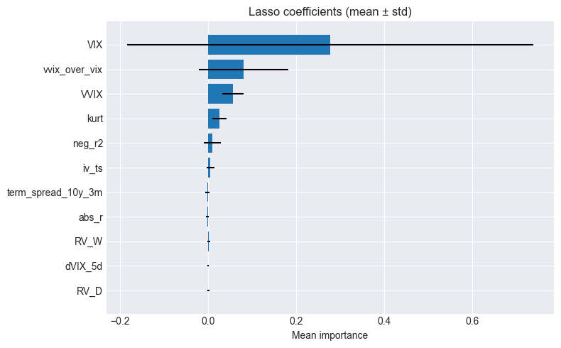
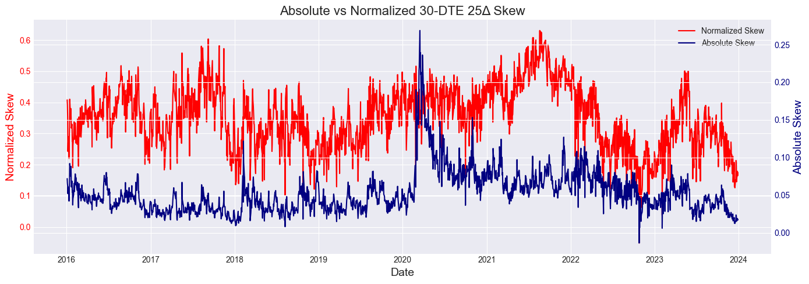
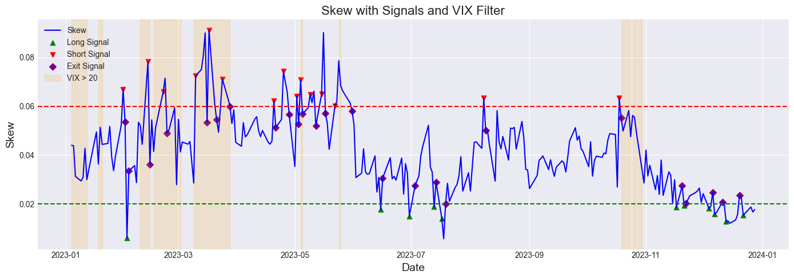
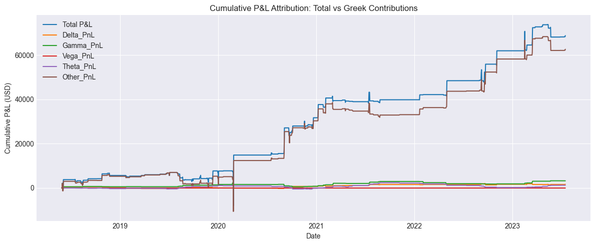

# **Volatility Trading on Equity Options**

[](https://github.com/anthonymakarewicz/volatility-trading/actions/workflows/ci.yml)
[](https://github.com/anthonymakarewicz/volatility-trading/actions/workflows/pages.yml)
[](https://www.python.org/)
[](https://github.com/astral-sh/ruff)
[](https://github.com/microsoft/pyright)
[](https://pre-commit.com/)

This project develops and evaluates daily options-volatility strategies on index and single-stock underlyings.
Research spans the full pipeline: data engineering and quality checks, implied-volatility surface modelling, volatility forecasting, and strategy backtesting.
Backtests use realistic execution assumptions (bid/ask, slippage, commissions, position sizing, and risk limits) and are documented with reproducible notebooks and published reports.

Notebook reports (GitHub Pages): [https://anthonymakarewicz.github.io/volatility-trading/](https://anthonymakarewicz.github.io/volatility-trading/)

## **Quickstart**

1. Clone the repository:

```bash
git clone https://github.com/anthonymakarewicz/volatility-trading.git
cd volatility_trading
```

2. Create a virtual environment and install runtime dependencies (Python 3.12+):

```bash
python -m venv .venv
source .venv/bin/activate
pip install -r requirements.txt
```

3. Optional (development setup: runtime + dev tools + tests):

```bash
pip install -r requirements-dev.txt
```

`requirements-dev.txt` already includes all runtime dependencies from
`requirements.txt`.

4. Set credentials (ORATS):

```bash
cp .env.example .env
```

Then set `ORATS_API_KEY`, `ORATS_FTP_USER`, and `ORATS_FTP_PASS` in `.env`.

## **ORATS ETL Pipeline (End-to-End)**

Pipeline steps:
- API download
- API extract
- FTP download
- FTP extract
- Build options chain
- Build daily features
- QC options chain
- QC daily features

Use `--dry-run` to validate config, paths, and credentials before running writes/network.

```bash
orats-api-download --config config/orats_api_download.yml --dry-run
```

For the full command sequence, see [Data pipeline](docs/data_pipeline.md).

## **Tests**

Run unit tests (default):

```bash
pytest -q
```

Run integration tests:

```bash
pytest -q -m integration
```

See [Test structure](docs/test_structure.md) for layout and conventions.

## **Continuous Integration (CI)**

GitHub Actions runs:
- Ruff lint + format checks
- Pyright type checks
- Unit tests by default
- Integration tests on pushes to `main` (and manual runs)

See [CI workflow](.github/workflows/ci.yml).

## **Developer Workflow**

Common commands are available via `Makefile`:

```bash
make lint
make format
make check
make typecheck
make test
make test-unit
make test-integration
make sync-nb
make sync-nb-all
make ci
```

For full setup and tooling details, see [Development guide](docs/development.md).
For notebook pairing and sync workflow, see [Jupytext workflow](docs/jupytext.md).
For notebook summaries and published report links, see [Notebook catalog](docs/notebooks.md).
For deployment details, see [Publishing](docs/publishing.md).
Notebook HTML reports are built in GitHub Actions and published to GitHub Pages.

## **Docs**

See:
- [Development guide](docs/development.md) for local dev workflow, pre-commit, and dependency updates
- [Entrypoints](docs/entrypoints.md) for CLI entrypoints and flags
- [Configs](docs/configs.md) for YAML schema and config reference
- [Data pipeline](docs/data_pipeline.md) for the end-to-end pipeline flow
- [Troubleshooting](docs/troubleshooting.md) for common errors and fixes
- [Test structure](docs/test_structure.md) for tests and how to run them
- [Jupytext workflow](docs/jupytext.md) for notebook pairing, sync, and reproducible execution
- [Notebook catalog](docs/notebooks.md) for notebook summaries and report links
- [Publishing](docs/publishing.md) for GitHub Pages build and deploy workflow
- [See the full package here](docs/package_structure.md)


## **Research Notebooks and Results**


## **Realized Volatility Forecasting (HAR-RV-VIX vs RF)**

We build a **21-day realized variance** forecasting model on ES futures (2010–2025) and compare:

- **Naive RV benchmark** – carry current 21D RV forward
- **HAR-RV** – classic daily / weekly / monthly RV lags
- **HAR-RV-VIX** – HAR-RV + VIX as a forward-looking volatility proxy
- **Random Forest (RF)** – non-linear benchmark on the same feature set

Before model selection, we run a **feature-importance & stability analysis** (SFI, Lasso, RF, permutation importance) to keep only **parsimonious, economically sensible** predictors for the linear and RF models.



---

### OOS Performance (2021–2025, monthly walk-forward, 3Y rolling window)

All metrics are computed on **log 21D RV**, using an expanding walk-forward with **3-year rolling re-fit** and a **21-day purge**.

| model      |   R²    |   MSE    |  QLIKE   | Var_res | R²_oos|
|:----------|:-------:|:--------:|:--------:|:-------:|:------:|
| Naive_RV  | 0.0943  | 0.5078   | 0.2791   | 0.5080  | 0.0000 |
| HAR-RV    | 0.2920  | 0.3970   | 0.2086   | 0.3920  | 0.2182 |
| HAR-RV-VIX| 0.3676  | 0.3546   | 0.1788   | 0.3549  | 0.3017 |


---

###  Takeaways

- **HAR-RV-VIX** is the **final candidate model**: it clearly beats both **Naive RV** and **HAR-RV** in OOS $R²$, MSE and QLIKE, and delivers a **~30% $R²_{oos}$** vs the naive benchmark.
- The **Random Forest** does **not** improve on HAR-RV-VIX in the validation period and is therefore **not carried forward** to the final walk-forward evaluation.
- All modelling choices (features, models, hyper-parameters) were fixed on **2010–2020**; the **2021–2025** walk-forward backtest is run **once** to avoid backtest-tuning bias.

[Full notebook](notebooks/rv_forecasting.ipynb)


## **Implied Volatility Surface Modelling (Parametric vs Non-Parametric)**


[Full notebook](notebooks/iv_surface_modelling.ipynb)


## **Skew Volatility Trading (30 DTE / 25 Δ)**

Trade the 30-day to expiry, 25 Delta SPX put–call skew via a delta-hedged risk reversal:

- **Synthetic Skew**
  – Interpolate across expiries to build a continuous “30 DTE / 25 Δ” skew series.

- **Entry / Exit**
  – **Short RR** when skew z-score ≥ 1.5 (too steep)
  – **Long RR** when skew z-score ≤ –1.5 (too flat)
  – **Exit** when |z-score| ≤ 0.5



---

### **Signal Filters**
- **VIX Filter:** Block entries if VIX > 30
- **IV Percentile:** Trade only when ATM IV is within its 20–80 historical percentile
- **Skew Percentile:** Trade only when skew is below its 30th (for longs) or above its 70th (for shorts) percentile



---

### Backtest Overview
We run a walk-forward backtest on daily SPX options (2016 – 2023), starting with \$100 000 of capital.

### Configuration

- **Entry Rule**
50-day z-score mean-reversion on normalized skew (|z| ≥ 1.5 triggers a risk reversal; exit when |z| falls below 0.5)

- **Signal Filters**
  - **VIX Filter:** Skip trades when VIX > 30
  - **Skew Percentile:** Only go long when normalized skew falls below its 30th percentile, and short when it rises above its 70th percentile

- **Execution Costs**
  - **Bid/Ask & Slippage:** Fill sells at the bid, buys at the ask + \$0.01 slippage per leg
  - **Commissions:** \$1 per option leg

- **Risk Controls**
  - **Delta Hedging:** E-mini S&P 500 futures (ES=F) used to neutralize net Δ (lot size = 50)
  - **Position Sizing:** Dynamically scale trade size by signal strength (base 1% of equity at entry-threshold, +0.5% per additional 0.5σ) and cap it at 2%
  - **Risk Floor:** Enforce a minimum \$750 worst-case risk per contract to prevent oversized position sizing when Greek-based risk is very low
  - **Stop-Loss & Take-Profit:** SL at 100% of notional, TP at 70% of notional
  - **Holding Period Cap:** 3 business days (skip negative theta trades on Fridays if 2-day θ decay > 200)

[Full notebook](notebooks/skew_trading.ipynb)

---

### Performance Results




---

### 🔍 **Overall Performance Metrics**

| Metric                    | Value          |
|:--------------------------|:--------------:|
| **Sharpe Ratio**          | 0.61           |
| **CAGR**                  | 10.73%         |
| **Average Drawdown**      | –1.62%         |
| **Max Drawdown**          | –14.61%        |
| **Max Drawdown Duration** | 287 days       |
| **Historical VaR (99%)**  | –0.87%         |
| **Historical CVaR (99%)** | –2.64%         |
| **Total P&L**             | \$68,754.99    |
| **Profit Factor**         | 2.66           |
| **Trade Frequency**       | 15.2 trades/yr |
| **Total Trades**          | 78             |
| **Win Rate**              | 62.82%         |
| **Avg Win P&L**           | \$2,271.04     |
| **Avg Loss P&L**          | –\$1,444.52    |
