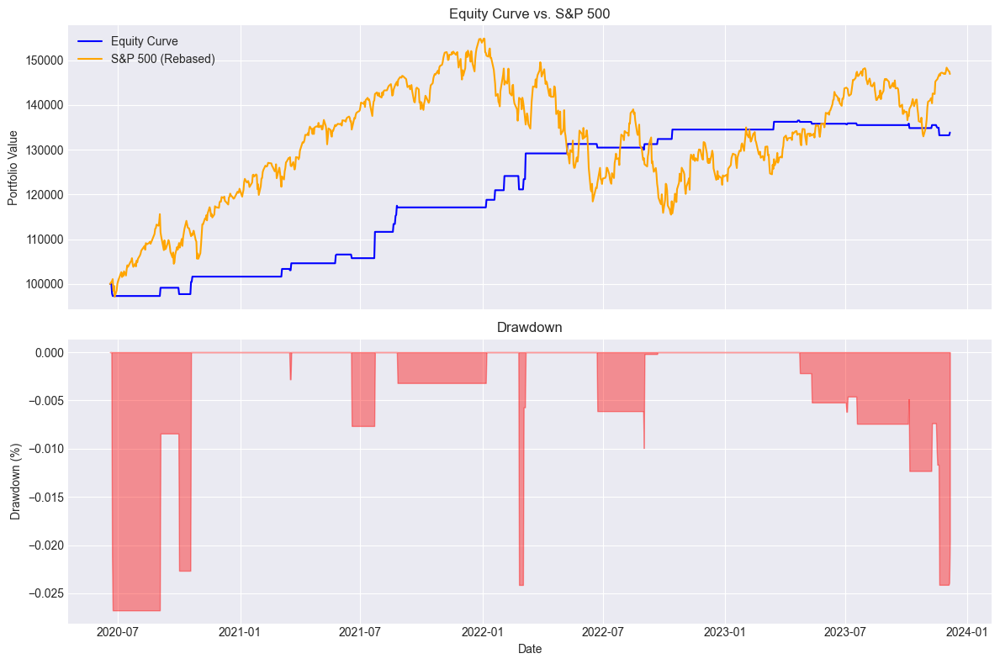

# **Volatility Trading on Index Equity Options**

This projects presents several daily volatility trading staregies on SPX Index Equity Option.

## **Skew Trading**

These rolling Z-score's signals of the 30-DTE 25-Delta are filtered by Macro VIX filter.

This backtest uses the **Z-score** of the **30-DTE, 25-Delta normalized skew** to generate trading signals on the **SPY ETF**.  

