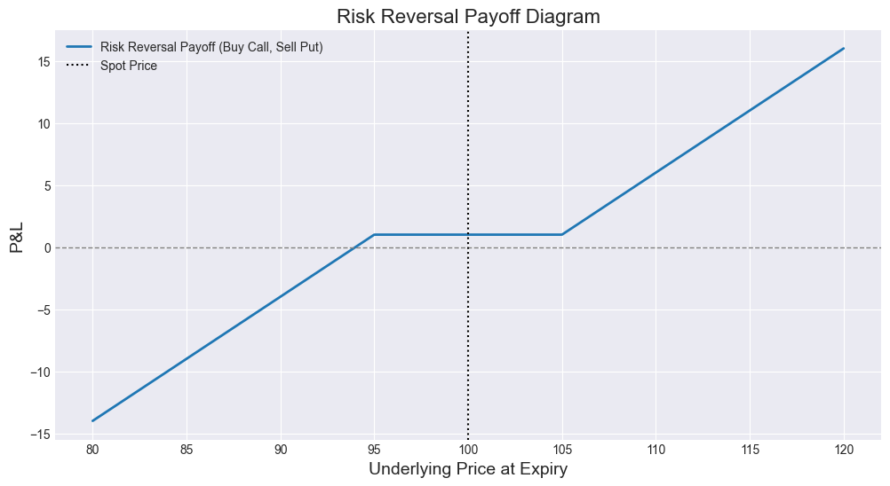
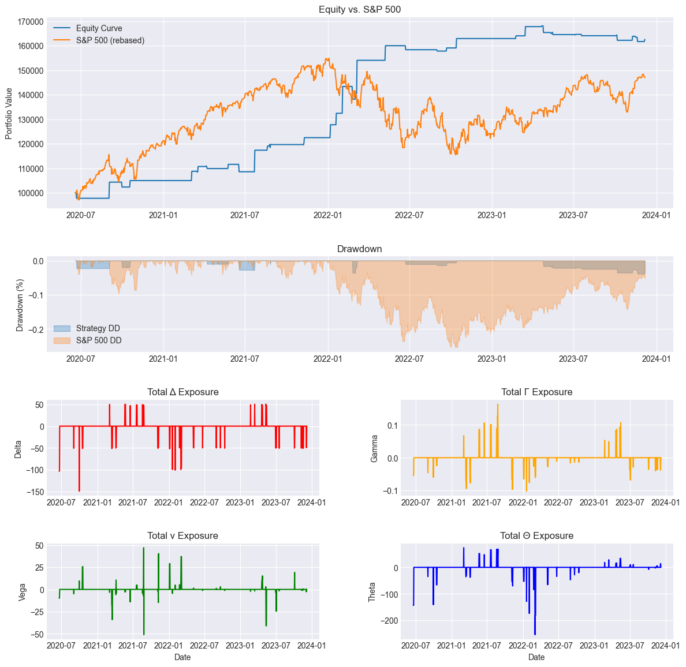

# **Volatility Trading on Index Equity Options**

This projects presents several daily volatility trading strategies on SPX Index Equity Options.
Each strategy is thoroughly backtested and appropriate risk management constraints are considered.

## **Skew Trading**
We use the **30-DTE 25-Delta Skew** to capture the behaviour of the skew. To express our view 
on the skew being abnormally steep or flat, we use a **Risk Reversal structure**.

### **Trading signals using the Z-score & VIX Sentiment filter for trade quality**
To generate trading signals, we use a **rolling Z-score** of this skew to capture large deviations.
In addition, are filtered by the **VIX** to avoid trading durign panic regimes.

### **Backtest using Walk-Forward cross validation, risk management, and realistic backtest constraints**
This is the result of a backtest using a **rolling Skew percentile** with thresholds 20% and 80% used to validate each trade.
