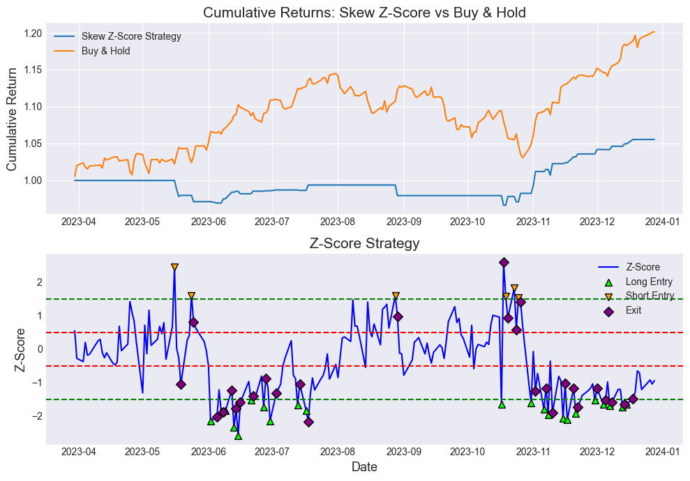

# **Volatility Trading on Index Equity Options**

This projects presents several daily volatility trading staregies on American Index Equity Options.

## **Skew Trading**

This backtest uses the Z-score of the 30-DTE 25-Delta absolute skew to generate trading signals on the SPY ETF.

