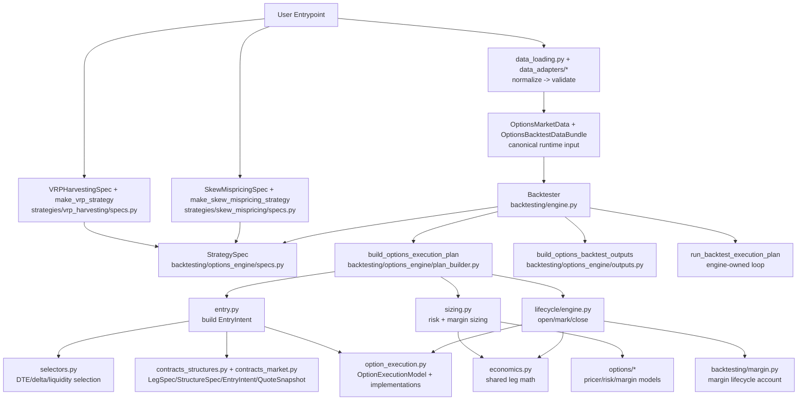
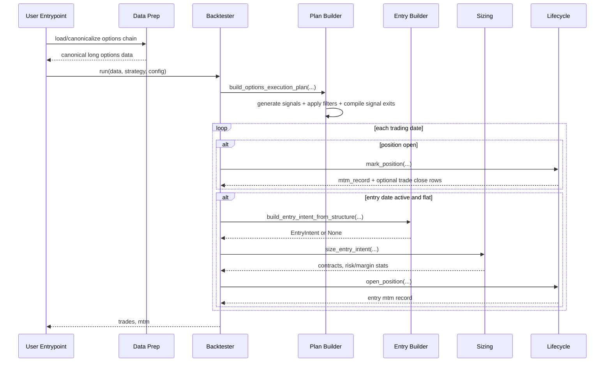
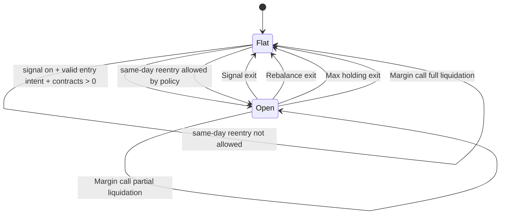

# Options Backtesting Architecture

This document describes how the current options backtesting stack is wired, from
`Backtester` orchestration to strategy-specific presets such as VRP harvesting.

For a deeper module-by-module and dataclass-level view, see
[`docs/reference/backtesting/architecture_internals.md`](architecture_internals.md).
For hedging policy usage (fixed band vs WW), see
[`docs/reference/backtesting/hedging.md`](hedging.md).
For option fill/cost model behavior, see
[`docs/reference/backtesting/option_execution.md`](option_execution.md).

## Scope

- Covered: options strategy runtime (`backtesting/` + `backtesting/options_engine/`)
- Not covered: data ETL/QC pipelines and model research notebooks

## Design Intent

The architecture separates:

1. **Backtest orchestration** (engine, execution loop, strategy-spec contract)
2. **Generic options execution runtime** (entry selection, sizing, lifecycle)
3. **Strategy presets** (VRP, skew, or future IV-RV variants)

This keeps strategy-specific code minimal while reusing the same lifecycle and
accounting logic across structures (single-leg or multi-leg).

## Component View

## Runtime Sequence (One Backtest Run)

## Position State Machine

## Core Business Logic

### 1) Entry Construction (`entry.py`, `selectors.py`)

- Structure is defined as `StructureSpec(legs=tuple[LegSpec, ...])`.
- Legs can be grouped by `expiry_group` so related legs share one chosen expiry.
- For each group:
  - candidate expiries are filtered by DTE band,
  - each leg candidate is filtered by hard constraints (delta band, OI, volume, spread),
  - best quote per leg is scored,
  - best expiry is selected using DTE distance + weighted leg score.
- Fill policy is applied at structure level (`all_or_none` or `min_ratio`).

### 2) Sizing (`sizing.py`)

- Builds option-risk `OptionLeg` objects from selected legs.
- Reuses shared execution economics (`economics.py`) for signed side/units.
- Computes:
  - risk-based contract limit (scenario worst loss),
  - margin-based contract limit (initial margin budget),
  - final contract count as constrained combination.

### 3) Lifecycle + Accounting (`lifecycle/engine.py`, `backtesting/margin.py`)

- `open_position`: initializes Greeks, MTM baseline, margin account fields.
- `mark_position`: daily MTM, Greeks refresh, financing/margin updates.
- Option leg fills/costs are delegated to `OptionExecutionModel`.
- Option market PnL and option trade costs are attributed separately.
- Applies signal exits and exit rules, then emits trade rows on close.
- Structure-level stop-loss / take-profit exits are available through
  `StopLossExitRule` and `TakeProfitExitRule`, using
  `pnl_per_contract = (valuation.pnl_mtm - entry_option_trade_cost + hedge.pnl)
  / contracts_open`.
- The current exit-rule basis excludes hypothetical exit costs; future advanced
  calibration may add risk-based bases such as `entry_risk_multiple`.
- Supports forced partial/full liquidation from margin lifecycle.

### 4) Runtime Loop (`engine.py`)

- Engine-owned single-position date loop (`engine.py`):
  - mark open position first,
  - optionally allow same-day reentry based on exit-type policy,
  - open new position only on active entry dates.
- Output serialization/aggregation is delegated to `outputs.py` (not plan compilation).

## Contracts and Boundaries

### Backtester Boundary

- `Backtester` consumes a concrete `StrategySpec`.
- `Backtester` compiles that spec into a `SinglePositionExecutionPlan` and owns the
  runtime execution loop.
- The execution-plan contracts live in
  `backtesting/options_engine/contracts/execution.py`.

### Options Runtime Boundary

- `backtesting/options_engine/` contains pure options-domain building blocks:
  entry selection, sizing, lifecycle, exit rules, and plan compilation.
- It does not own top-level run orchestration.

### Configuration Boundary

- `StrategySpec` carries strategy intent and policy:
  signal/filter wiring, structure selection, lifecycle policy, sizing policy.
- `LifecycleConfig` can be periodic, signal-driven, or signal-driven with an
  optional max-holding safety cap.
- `BacktestRunConfig` carries run-time environment assumptions:
  account, execution, broker margin rules, pricing/risk engines, optional date window.
- `OptionsBacktestDataBundle` carries market inputs:
  `options_market` (canonical long chain plus chain-level metadata), optional
  features panel, and optional `hedge_market`.
- Source-specific options data should be normalized/validated before
  constructing `OptionsMarketData(...)`.
- `OptionsMarketData` is the runtime data boundary and validates canonical long
  options input at construction time.
- `build_options_execution_plan(...)` consumes canonical runtime input only; it
  does not own source-specific options-chain normalization.
- Margin model/policy and pricing/risk engines are configured at run level, not preset level.
- Dynamic delta hedging is strategy policy (`StrategySpec.lifecycle.delta_hedge`),
  while hedge execution behavior is run-level via
  `BacktestRunConfig.execution.hedge_execution_model`.
- Option execution behavior is run-level via
  `BacktestRunConfig.execution.option_execution_model`.
- If dynamic hedging is enabled, `data.hedge_market` is required.
- Hedge model behavior and examples are documented in
  [`docs/reference/backtesting/hedging.md`](hedging.md).
- Option execution model behavior and attribution fields are documented in
  [`docs/reference/backtesting/option_execution.md`](option_execution.md).

## Strategy Preset Pattern

Current presets:

- `VRPHarvestingSpec` + `make_vrp_strategy(spec)`
- `SkewMispricingSpec` + `make_skew_mispricing_strategy(spec)`

Skew semantics note:
- raw skew is defined as `25d put IV - 25d call IV`
- the default skew preset trades contrarian to that raw skew:
  unusually steep skew buys the risk reversal, unusually flat skew sells it

This pattern is reusable for future presets such as:

- IV-RV mispricing
- Earnings vol-crush/rush structures

Each preset should primarily define:

1. signal + filters
2. structure spec (legs and constraints)
3. side resolver
4. lifecycle/sizing policy defaults

## Extension Points

Add new strategy behavior by configuration first:

- New structure: add `LegSpec` legs in `StructureSpec`
- New exit logic: implement `ExitRule` and attach to `ExitRuleSet`
- Built-in presets (`VRPHarvestingSpec`, `SkewMispricingSpec`) also expose
  `stop_loss_pnl_per_contract` / `take_profit_pnl_per_contract` convenience
  fields for structure-level richer exits.
- New sizing logic: adjust `StrategySpec.sizing` and/or provide another `RiskBudgetSizer`
- New pricing/risk model: set `BacktestRunConfig.modeling` engines
- New margin model/policy: set `BacktestRunConfig.broker.margin`
- Dynamic delta hedging: set `StrategySpec.lifecycle.delta_hedge` and supply
  `OptionsBacktestDataBundle.hedge_market`
- New option execution behavior: inject custom `OptionExecutionModel` via
  `BacktestRunConfig.execution.option_execution_model`

Only add new engine code when behavior cannot be expressed through these
contracts.

## Practical Rule of Thumb

- If logic is reusable across options strategies, it belongs in
  `backtesting/options_engine/`.
- If logic is a business preset or parameter bundle, it belongs in
  `strategies/<strategy_name>/specs.py`.
