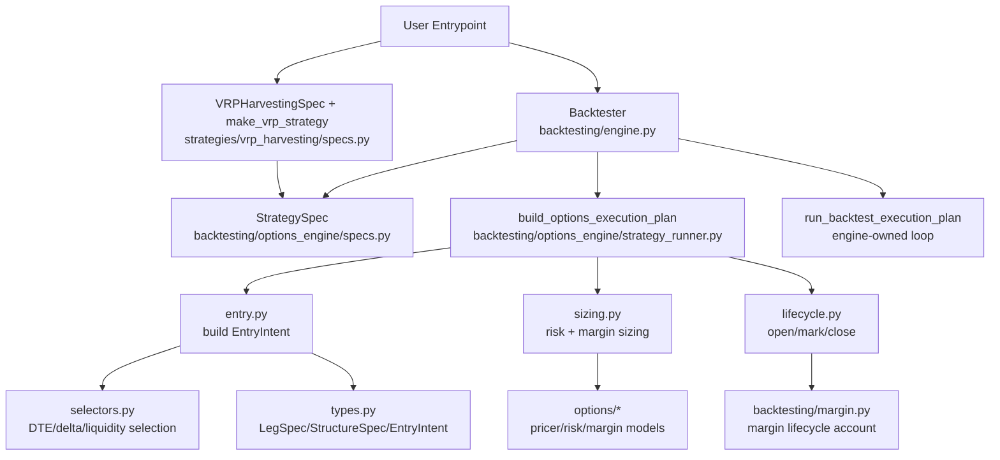
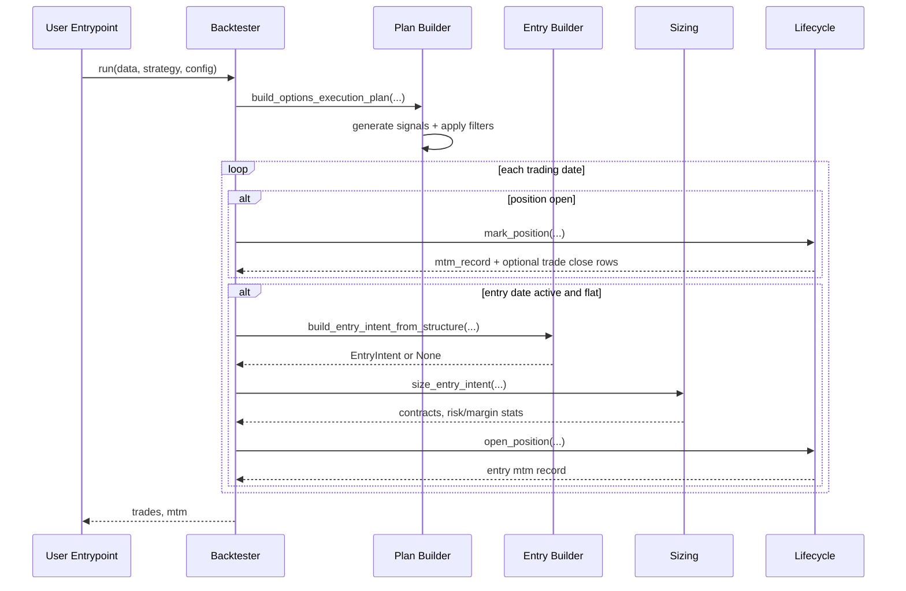
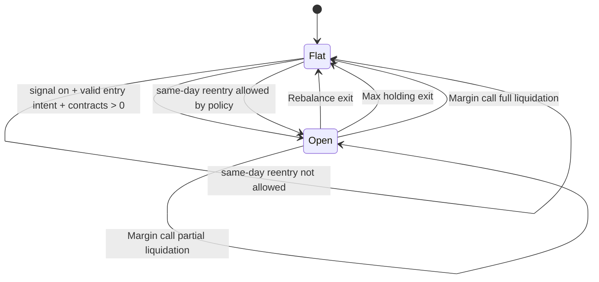

# Options Backtesting Architecture

This document describes how the current options backtesting stack is wired, from
`Backtester` orchestration to strategy-specific presets such as VRP harvesting.

## Scope

- Covered: options strategy runtime (`backtesting/` + `backtesting/options_engine/`)
- Not covered: data ETL/QC pipelines and model research notebooks

## Design Intent

The architecture separates:

1. **Backtest orchestration** (engine, execution loop, strategy-spec contract)
2. **Generic options execution runtime** (entry selection, sizing, lifecycle)
3. **Strategy presets** (VRP or future skew/IV-RV variants)

This keeps strategy-specific code minimal while reusing the same lifecycle and
accounting logic across structures (single-leg or multi-leg).

## Component View

## Runtime Sequence (One Backtest Run)

## Position State Machine

## Core Business Logic

### 1) Entry Construction (`entry.py`, `selectors.py`)

- Structure is defined as `StructureSpec(legs=tuple[LegSpec, ...])`.
- Legs can be grouped by `expiry_group` so related legs share one chosen expiry.
- For each group:
  - candidate expiries are filtered by DTE band,
  - each leg candidate is filtered by hard constraints (delta band, OI, volume, spread),
  - best quote per leg is scored,
  - best expiry is selected using DTE distance + weighted leg score.
- Fill policy is applied at structure level (`all_or_none` or `min_ratio`).

### 2) Sizing (`sizing.py`)

- Builds option-risk `OptionLeg` objects from selected legs.
- Computes:
  - risk-based contract limit (scenario worst loss),
  - margin-based contract limit (initial margin budget),
  - final contract count as constrained combination.

### 3) Lifecycle + Accounting (`lifecycle.py`, `backtesting/margin.py`)

- `open_position`: initializes Greeks, MTM baseline, margin account fields.
- `mark_position`: daily MTM, Greeks refresh, financing/margin updates.
- Applies exit rules (`exit_rules.py`) and emits trade rows on close.
- Supports forced partial/full liquidation from margin lifecycle.

### 4) Runtime Loop (`engine.py`)

- Engine-owned single-position date loop (`engine.py`):
  - mark open position first,
  - optionally allow same-day reentry based on exit-type policy,
  - open new position only on active entry dates.

## Contracts and Boundaries

### Backtester Boundary

- `Backtester` consumes a concrete `StrategySpec`.
- `Backtester` compiles that spec into a `BacktestExecutionPlan` and owns the
  runtime execution loop.

### Options Runtime Boundary

- `backtesting/options_engine/` contains pure options-domain building blocks:
  entry selection, sizing, lifecycle, exit rules, and plan compilation.
- It does not own top-level run orchestration.

## Strategy Preset Pattern

Current VRP preset:

- `VRPHarvestingSpec` defines business defaults
- `make_vrp_strategy(spec)` returns a concrete `StrategySpec`

This pattern is reusable for future presets:

- Skew mispricing
- IV-RV mispricing
- Earnings vol-crush/rush structures

Each preset should primarily define:

1. signal + filters
2. structure spec (legs and constraints)
3. side resolver
4. risk/margin policy defaults

## Extension Points

Add new strategy behavior by configuration first:

- New structure: add `LegSpec` legs in `StructureSpec`
- New exit logic: implement `ExitRule` and attach to `ExitRuleSet`
- New sizing logic: provide `RiskSizer`/`RiskEstimator`/`MarginModel`
- New pricing model: pass another `PriceModel`

Only add new engine code when behavior cannot be expressed through these
contracts.

## Practical Rule of Thumb

- If logic is reusable across options strategies, it belongs in
  `backtesting/options_engine/`.
- If logic is a business preset or parameter bundle, it belongs in
  `strategies/<strategy_name>/specs.py`.
