# Options Backtesting Architecture Internals

This document is the developer-facing deep dive for the options backtesting
stack. It explains how modules interact, which dataclasses cross boundaries,
and why the current architecture is organized this way.

For a shorter overview, see
[`docs/reference/options_backtesting_architecture_overview.md`](options_backtesting_architecture_overview.md).

## Scope

- Covered:
  - `src/volatility_trading/backtesting/engine.py`
  - `src/volatility_trading/backtesting/options_engine/**`
  - `src/volatility_trading/backtesting/margin.py`
  - key domain types under `src/volatility_trading/options/types.py`
- Not covered:
  - ETL/QC pipelines
  - forecasting/research notebooks

## 1) Layered Component Map

```mermaid
flowchart LR
    subgraph UserLayer[User / Strategy Presets]
        U1[Notebook / Script / CLI]
        U2[VRPHarvestingSpec\nstrategies/vrp_harvesting/specs.py]
        U3[StrategySpec\noptions_engine/specs.py]
    end

    subgraph Orchestrator[Backtesting Orchestrator]
        O1[Backtester\nbacktesting/engine.py]
        O2[run_backtest_execution_plan\nbacktesting/engine.py]
    end

    subgraph PlanCompiler[Options Plan Compiler]
        P1[build_options_execution_plan\noptions_engine/plan_builder.py]
        P2[SinglePositionExecutionPlan\noptions_engine/contracts.py]
        P3[SinglePositionHooks\noptions_engine/contracts.py]
    end

    subgraph RuntimeDomain[Options Runtime Domain]
        R1[entry.py\nnormalize_signals_to_on\nbuild_entry_intent_from_structure]
        R2[sizing.py\nsize_entry_intent]
        R3[lifecycle.py\nPositionLifecycleEngine\nopen_position/mark_position]
        R4[exit_rules.py\nExitRuleSet / SameDayReentryPolicy]
        R5[selectors.py\nquote/expiry selection]
        R6[economics.py\neffective side/units\ncommission helpers]
    end

    subgraph LifecycleInternals[_lifecycle Internal Modules]
        L1[valuation.py\nresolve_mark_valuation\nupdate_position_mark_state]
        L2[margining.py\nevaluate_entry_margin\nevaluate_mark_margin]
        L3[record_builders.py\nbuild_entry_record\nbuild_mark_record\nbuild_trade_record]
        L4[runtime_state.py\nEntry/Mark snapshots]
    end

    subgraph RuntimeContracts[Public Runtime Contracts]
        C1[state.py\nOpenPosition\nPositionEntrySetup\nLifecycleStepResult]
        C2[records.py\nMtmRecord\nTradeRecord]
    end

    subgraph ExternalDeps[Cross-Package Dependencies]
        X1[backtesting/margin.py\nMarginAccount / MarginPolicy]
        X2[options/*\nPriceModel / MarginModel / Risk stack]
        X3[options/types.py\nMarketState / Greeks]
    end

    U1 --> U2 --> U3
    U1 --> O1
    O1 --> P1
    O1 --> O2
    U3 --> P1
    P1 --> P2
    P1 --> P3
    P1 --> R1
    P1 --> R2
    P1 --> R3
    P1 --> R4
    R1 --> R5
    R2 --> R6
    R3 --> R6
    R3 --> L1
    R3 --> L2
    R3 --> L3
    R3 --> L4
    R3 --> C1
    R3 --> C2
    L2 --> X1
    R2 --> X2
    R3 --> X2
    L1 --> X3
    C2 --> X3
```



## 2) Core Runtime Contracts (Typed Boundaries)

The engine loop does not call entry/sizing/lifecycle directly. It runs a typed
plan with typed hooks.

```mermaid
flowchart TD
    A[StrategySpec] --> B[build_options_execution_plan]
    B --> C[SinglePositionExecutionPlan]
    C --> D[SinglePositionHooks]

    D --> D1[mark_open_position\n(OpenPosition, date, equity)\n-> LifecycleStepResult]
    D --> D2[prepare_entry\n(date, equity)\n-> PositionEntrySetup | None]
    D --> D3[open_position\n(PositionEntrySetup, equity)\n-> (OpenPosition, MtmRecord)]
    D --> D4[can_reenter_same_day\n(list[TradeRecord]) -> bool]

    C --> E[build_outputs\n(list[TradeRecord], list[MtmRecord], initial_capital)\n-> (trades_df, mtm_df)]
```

### Dataclass Composition Map


## 3) End-to-End Runtime Sequence


## 4) `mark_position` Decision Flow (Lifecycle Internals)


## 5) Module Responsibilities and Ownership

| Module | Owns | Does Not Own |
|---|---|---|
| `backtesting/engine.py` | orchestration loop, equity progression, top-level `Backtester.run()` | option quote selection, risk/margin formulas, trade construction details |
| `options_engine/contracts.py` | typed kernel boundary between engine and options runtime | business logic |
| `options_engine/plan_builder.py` | compile `StrategySpec` into executable plan + output serializer | date loop execution |
| `options_engine/entry.py` + `selectors.py` | build `EntryIntent` from chain + structure constraints | account/margin lifecycle |
| `options_engine/economics.py` | shared leg-side/units and per-structure commission helpers | signal/entry/exit orchestration |
| `options_engine/sizing.py` | contract count decision from risk/margin constraints | position mark/exit loop |
| `options_engine/lifecycle.py` | open/mark/close logic, forced liquidation, exit handling | signal generation, global orchestration |
| `options_engine/_lifecycle/*` | valuation/margin/record/state internals | plan compilation and outer loop |

## 6) Why This Architecture (Design Choices)

### Choice A: Engine owns execution loop

- Single place for date iteration and equity progression.
- Strategy modules cannot diverge in loop semantics.
- Easier to evolve to multi-position at one boundary.

### Choice B: Plan builder compiles plan instead of executing

- Clean separation between “what to run” and “how to run”.
- Allows unit testing plan compilation independent of runtime loop.
- Keeps strategy presets thin and declarative.

### Choice C: Concrete options-typed contracts (not broad `Any`)

- Stronger Pyright guarantees across engine <-> lifecycle boundary.
- Better IDE assistance for hooks and outputs.
- Fewer silent runtime shape mismatches.

### Choice D: Lifecycle internals split into `_lifecycle/*`

- Keeps `lifecycle.py` focused on control flow and business decisions.
- Valuation, margining, and serialization evolve independently.
- Tests can target specific responsibilities.

## 7) Invariants (Current Behavior)

1. One open position max at a time (single-position kernel).
2. MTM rows are appended daily for open positions and entry dates.
3. Equity progression is driven by cumulative `delta_pnl`.
4. Same-day reentry is governed exclusively by `reentry_policy`.
5. Final outputs are normalized pandas DataFrames (`trades`, `mtm`).

## 8) Extension Playbook

### Add a new options strategy preset

- Add preset spec/factory under `strategies/<name>/specs.py`.
- Output must be a valid `StrategySpec`.
- Reuse existing entry/sizing/lifecycle modules first.

### Add new exit behavior

- Implement new `ExitRule` in `exit_rules.py`.
- Register via `ExitRuleSet` in the strategy spec.

### Add new sizing behavior

- Extend risk estimator/sizer or margin model dependencies.
- Keep contract count decision in `size_entry_intent`.

### Add new accounting fields

- Add to public record dataclasses (`MtmRecord`/`TradeRecord`) first.
- Update serializer in `_lifecycle/record_builders.py`.
- Keep loop contract unchanged unless boundary shape truly changes.

### Prepare for multi-position support (future)

- Replace single `open_position` in engine loop with a position book.
- Generalize hooks to mark/open/close across multiple positions.
- Preserve existing plan-compiler boundary where possible.

## 9) File-Level Reading Order (Recommended)

1. `backtesting/engine.py`
2. `options_engine/contracts.py`
3. `options_engine/plan_builder.py`
4. `options_engine/specs.py`
5. `options_engine/entry.py`
6. `options_engine/sizing.py`
7. `options_engine/lifecycle.py`
8. `options_engine/state.py`
9. `options_engine/records.py`
10. `options_engine/_lifecycle/runtime_state.py`
11. `options_engine/_lifecycle/valuation.py`
12. `options_engine/_lifecycle/margining.py`
13. `options_engine/_lifecycle/record_builders.py`
