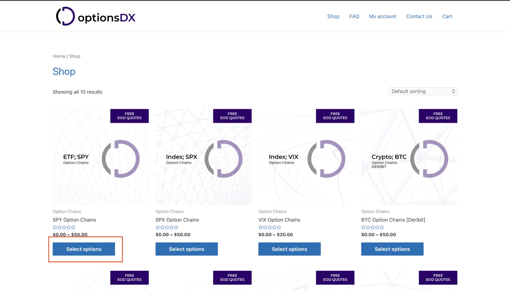
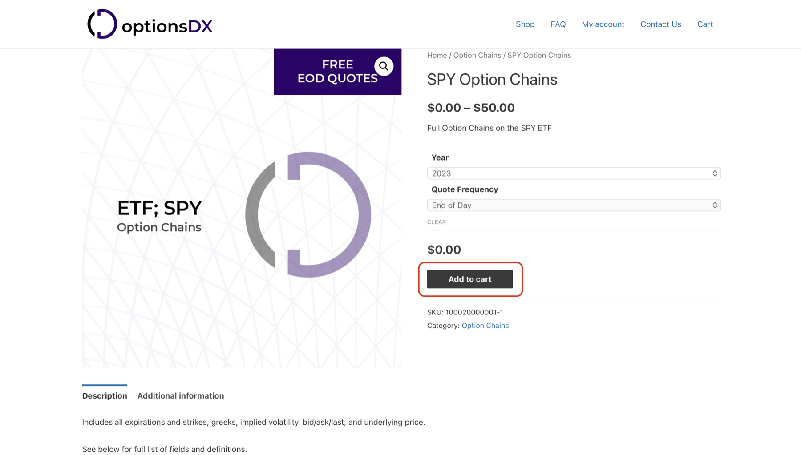
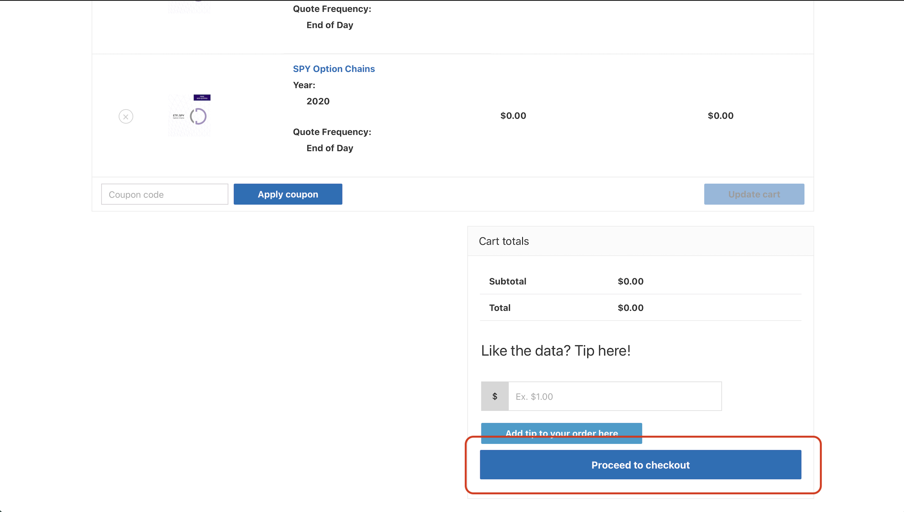
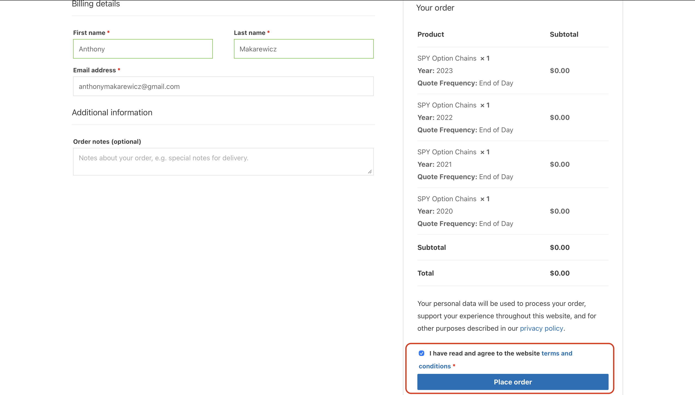
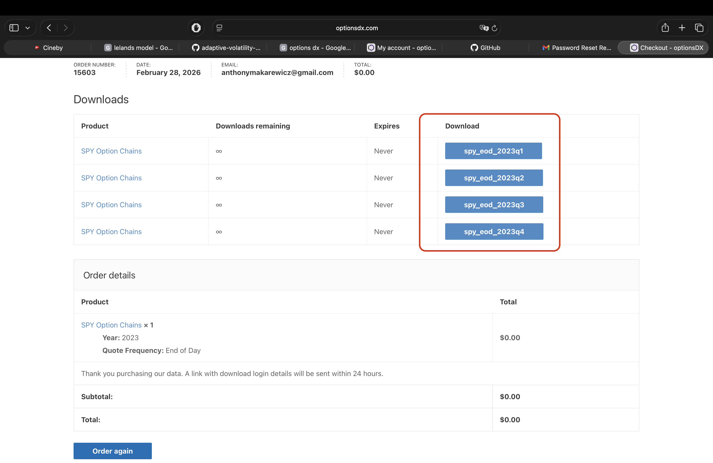

# OptionsDX Setup

If you do not have access to institutional options datasets, you can still run
the project with delayed end-of-day options chains from OptionsDX (for liquid
underlyings like SPY).

## 1. Open the product page

Go to: https://www.optionsdx.com/product



## 2. Select ticker, year, and frequency

Choose the asset you want (for example `SPY`), then select year and frequency
(for example `2023`, end-of-day), and add it to cart.

For daily frequency, historical data is free up to older years, but downloads
are typically handled one year at a time, so add multiple years to your cart.



## 3. Review cart

Open your cart, scroll down, and proceed to checkout.



## 4. Checkout

Accept terms and place the order.



## 5. Download and store files

Download each `.7z` file and place files under:

`data/raw/optionsdx/<TICKER>/<YEAR>/`

Example:

`data/raw/optionsdx/SPY/2010/`



## 6. Run ingestion

Run the extraction/processing pipeline to clean and store data in:

`data/processed/optionsdx/<TICKER>/`

When `reshape: long` is used, output columns are normalized to canonical
options-chain names (for example `trade_date`, `expiry_date`, `bid_price`,
`ask_price`, `market_iv`) to match backtesting contracts.

```bash
optionsdx-prepare-panel --config config/optionsdx/prepare_panel.yml --dry-run
optionsdx-prepare-panel --config config/optionsdx/prepare_panel.yml
```

Related docs:
- [Data Pipeline](data_pipeline.md)
- [Entrypoints](entrypoints.md)
